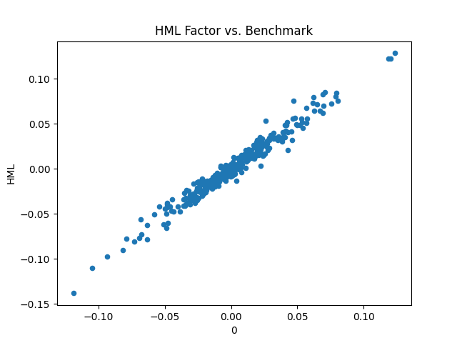
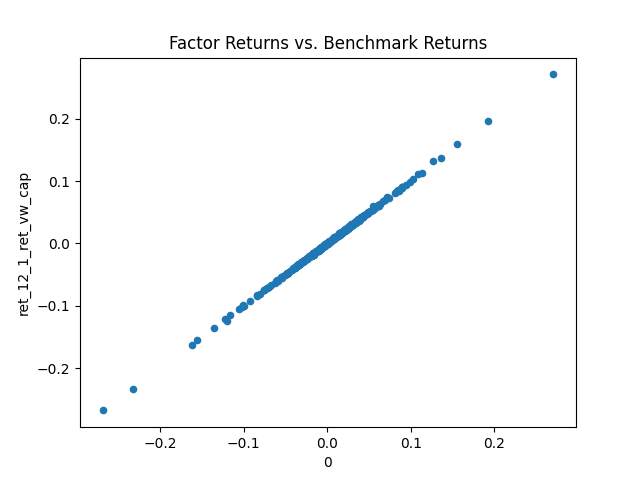
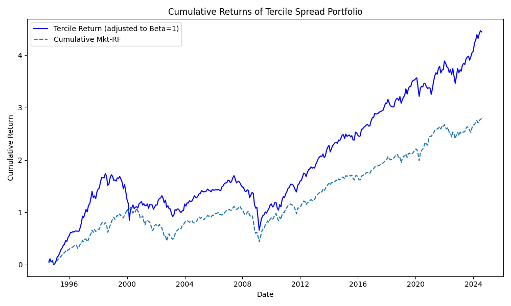
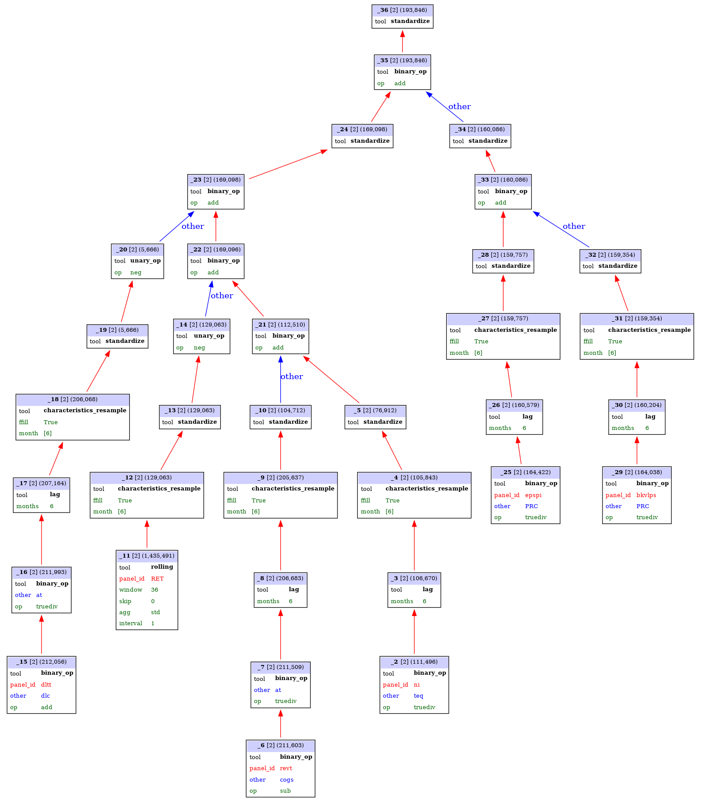
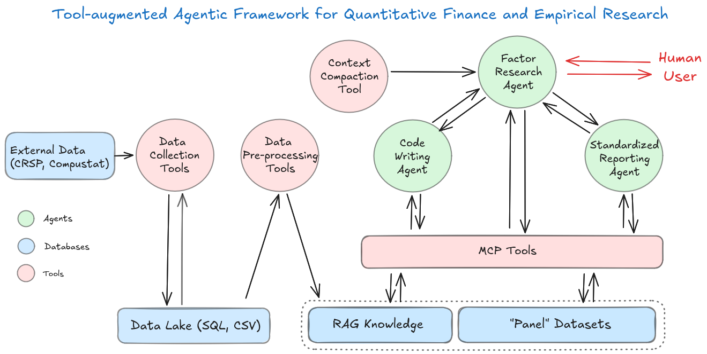

# Quantitative Research Assistants with Financial Tools and Intelligence (QRAFTI)

(c) Terence Lim 2026

A tool-augmented multi-agent framework designed to emulate a
quantitative research team, QRAFTI integrates (1) an empirical
research Python toolkit built for *panel* data, (2)
Model Context Protocol (MCP) tool servers that expose data- and
factor-manipulation operations as callable tools, (3) specialized
Pydantic-AI agents for factor research, standardized reporting, and
customized code writing and execution, and (4) Streamlit interface
for tracing tool calls and visualizing data artifact connections. It
demonstrates the use of LLM and agentic capabilities to simplify and
strengthen quantitative research workflows.

Lim, T., Muthuraman, K., & Sury, M. (2026). *QRAFTI: An agentic framework for empirical research in quantitative finance* [Preprint]. arXiv. [https://arxiv.org/abs/2604.18500](https://arxiv.org/abs/2604.18500)


[Internet Appendix: documentation and results](Internet_Appendix.pdf)

## QRAFTI Usage Examples

The following prompts illustrate how a user can work with QRAFTI for replication studies and autonomous factor research (see [Internet Appendix B](Internet_Appendix.pdf) for full conversation histories and traces)

### 1) Replicate Fama-French HML-style workflow

```text
Construct book equity as stockholder equity (seq) minus the book value of preferred stock,
where preferred stock is defined as the redemption (pstkrv), liquidation (pstkl), or par value (pstk),
if available, in that order.

Each December, divide book equity of a firm’s fiscal year-end at or before December
by the company market capitalization (CAPCO) at the end of the year.
Then construct book-to-market equity in June as the lagged values from the previous December.

Sort stocks independently on market equity (CAP) into small and big stocks using
the median market capitalization of all stocks traded on the NYSE as breakpoints,
and on book-to-market equity into growth, neutral, and value stocks using
the 30th and 70th percentiles of book-to-market equity of all stocks traded on the NYSE as breakpoints.

Form portfolios as the intersection of these sorts. The portfolios are weighted by market equity (CAP).
The HML factor portfolio is the average of a small and a big value portfolio minus the average of a
small and a big growth portfolio in each month.

Finally, create a scatter plot of the factor returns against its benchmark returns (with panel ID 'HML').

Compute the correlation between the factor returns and the benchmark
```

<p align="center">
  
  
</p>

### 2) Replicate JKP-style price momentum factor workflow

```text
Please use these three phases of the reflexion prompt technique to perform the query below.
Phase 1: Consider the entire query, and suggest a sequential order of steps to perform the query.
Phase 2: To reflect and self-critique, check that each step is implementable with available tools and
  that the steps can efficiently satisfy the objective of the query; you may query the user to provide
  any needed definitions.
Phase 3: Provide the corrected plan, but do not execute the steps yet.

Query:
Define price momentum characteristic as stocks' past 12 months returns skipping one month.
Sort stocks into characteristic terciles (top/middle/bottom third) with breakpoints
based on non-micro stocks, where micro stocks are all stocks whose market capitalization
is below the NYSE 20th percentile.

For each tercile, compute its "capped value" weighted portfolio, meaning that we weight stocks
by their market equity winsorized at the NYSE 80th percentile.

The factor returns are then defined as the top-tercile portfolio return minus the bottom-tercile
portfolio return.

Create a scatter plot of the factor returns against its benchmark returns (Panel ID 'ret_12_1_ret_vw_cap').
```

### 3) Autonomously generate and test a new factor idea

```text
Please suggest an innovative stock characteristic that can be constructed from commonly-available
financial statement items in Compustat and monthly stock returns in CRSP which implements the
investment philosophy of the renowned investor Warren Buffet. You should not write custom python code,
but can use all of the other tools available to you.

Guidelines:
- Any data items which are source from Compustat Annual must be lagged six months
- When combining components, the components should be first resampled every June.
- Prefer components and scores to be standardized real values, not quantile ranks.

Please execute the plan and provide a standardized research report.
```

<p align="center">
  
  
</p>

## Project Structure

Python modules for running *multi-agent* quantitative research workflows, including data/factor services, user access interface, and empirical analysis tooling (see [Internet Appendix A](Internet_Appendix.pdf) for details).




### 1) Research Service Layer
**Files:** `factor_server.py`, `coding_server.py`, `report_server.py`, `server_utils.py`, `research_utils.py`, `report_utils.py`

Provides the service-side components for exposing factor computations, custom tool coding, and report generation capabilities. Server helpers and shared common logic live in `server_utils.py`, `research_utils.py` and `report_utils.py`, while the MCP server entry points are separated by specialization (`factor_server.py`, `coding_server.py` and `report_server.py`).

### 2) Client Access Layer
**Files:** `st_client.py`, `shared_agents.py`, `agent_delegation.py`, `agent_cli.py`, `client_utils.py`

Contains client-side interfaces and shared agent composition utilities.
- `shared_agents.py` defines reusable model + agent factories used by multiple apps.
- `agent_delegation.py` defines reusable delegation tool wiring (`report_agent_tool`, `coding_agent_tool`) that can be attached to the research agent in any runtime.
- `st_client.py` is the Streamlit UI entrypoint and imports the shared factories.
- `agent_cli.py` is a standalone Python CLI example showing how to use the same agents outside Streamlit.
- `client_utils.py` centralizes reusable client helpers.

### 3) Financial Intelligence Toolkit
**Files:** `qrafti.py`, `utils.py`, `portfolio.py`, `rag.py`, `data_utils.py`

Contains core analytical and orchestration modules for portfolio-focused research workflows, including shared utilities, retrieval-augmented functionality, and operational/restart helpers.

### 4) Data Sources

CRSP, Compustat


## Running the reusable clients

- Streamlit UI: `streamlit run st_client.py --server.fileWatcherType="poll"`
- Standalone CLI: `python agent_cli.py`

Both entry points reuse the same agent definitions from `shared_agents.py`.
